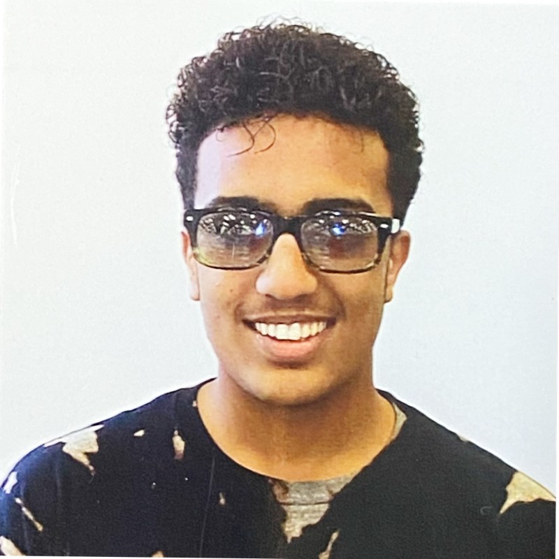

# Hisham's User Page
##  ***Who Am I?***
Hello World! My name is Hisham Baobaid, and I am currently a second-year undergraduate at UC San Diego, focusing on obtaining my Bachelor of Science degree in Computer Science.  
  
    <---- This is me
  
I love volunteering and giving back to my community. In the past, I have worked with the CSE Department at UC San Diego and tutored for CSE 11, a class with hundreds of students. As a tutor, I would walk through programming assignments with students and point them in the right direction.  
  
When it comes to CSE I have experience in multiple programming languages such as Java, C, C++, and ARM Assembly. I intend to further my knowledge in not just programming but in other departments of STEM as well.
##  Education:
Insert info here 
##  ***Where It All Started?***
Insert info here  
##  ***What Are My Passions and Hobbies?***
Insert info here  
t  
t  
t  
t  
t  
   
[Go to Who Am I?](#who-am-i?)
[Go to Education](#education)
[Go to Where It All Started?](#where-it-all-started)
[Go to What Are My Passions and Hobbies?](#passions-and-hobbies)
