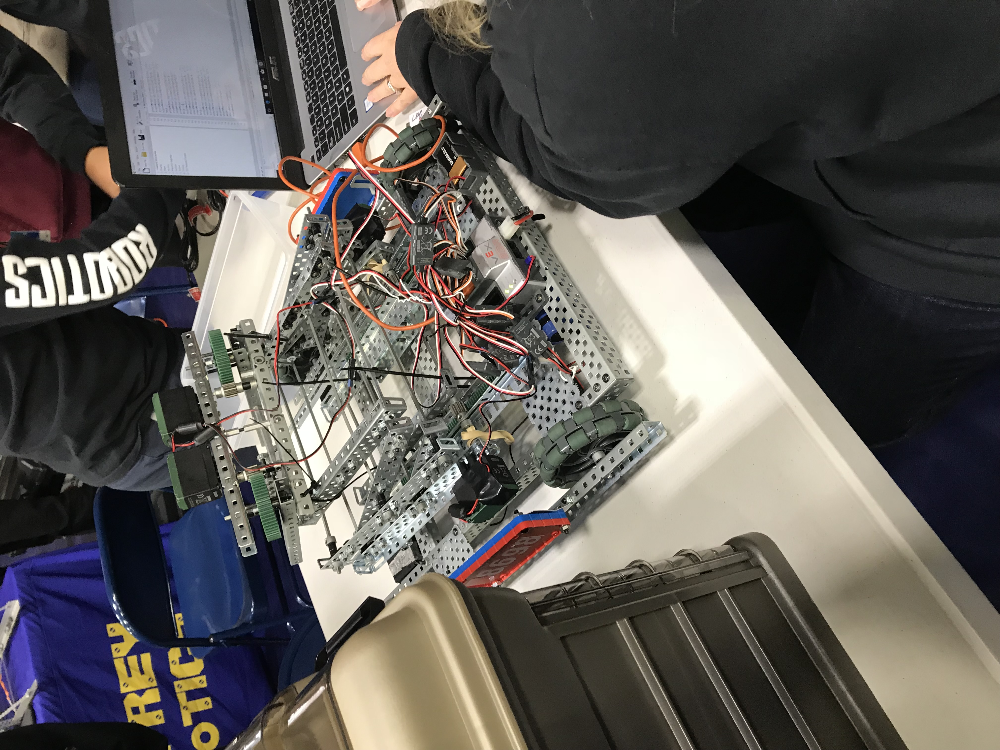

# Hisham's User Page
## Table of Contents:
1. [Go to Who Am I?](#who-am-i?)
2. [Go to Where It All Started?](#where-it-all-started)
3. [Go to What Was My Education Like?](#education)
4. [Go to What Are My Passions and Hobbies?](#passions-and-hobbies)
5. [Go to More About Me](#more-about-me)
## <a name="who-am-i?"></a> ***Who Am I?***  


> ${\color{#70ce1c}Hello \space \space World}$

My name is Hisham Baobaid, and I am from San Diego, CA. I am currently a second-year undergraduate at [UC San Diego](https://ucsd.edu/), focusing on obtaining my Bachelor of Science degree in Computer Science.  
  
I love volunteering and giving back to my community. In the past, I have worked with the [CSE Department at UC San Diego](https://cse.ucsd.edu/) and tutored for CSE 11, a class with hundreds of students. As a tutor, I would walk through programming assignments with students and point them in the right direction.  
  
When it comes to CSE I have experience in multiple programming languages such as Java, C, C++, and ARM Assembly. I intend to further my knowledge in not just programming but in other departments of STEM as well.  

[Picture of me!](https://github.com/hbaobaid00/projects/blob/main/linkedinprofile.jpg)
## <a name="where-it-all-started"></a> ***Where It All Started?***
My passion for computer science and engineering started around middle school. I had joined a Robotics class I thought robots were intriguing and wanted to learn more about them. Turns out, we made our built our own robot and even had a competition for who could complete the obstacle course the fastest. This class has taught me what it would be like to be an engineer because we would practice skills that an engineer would practice. These consist of:  
* **Design and Plan**
* **Group Meetings**
* **Research**
* **Implementation**
* **Testing**
* **Debugging**
* **Maintenance**  

As we were working on this year-long project, I specifically remember that I enjoyed coding up the robot the most, because it was my code that made the robot move around and perform certain actions. Building the robot was also a fun task because it reminded me of playing with legos which was a hobby I had as a kid.  

Despite our hard work and time put into this project, it was not enough for my team to win the competition. This helped me realize that it is okay to fail. It might not feel the best, but failure is inevitable. 

Even though we failed, I am still proud of what we accomplished:  



## <a name="education"></a> ***What Was My Education Like?***  

After discovering a new passion in middle school, I was set on wanting to become an engineer for the future. Everything I did in school was to get one step closer to that goal. For instance, when I took a 3-year CSE pathway at my high school, I did it in hopes that it would make me a better programmer which it did. I believe that pathway is what led me to where I am today. It taught me how to be consistent and motivated with my work which is something I value deeply. 

When it came to high school, I constantly strived to be the best version of myself. I took my academics seriously in hopes of getting an excellent GPA for college. I would always take AP and honors classes every chance I got. I even took a couple of community college classes to get ahead in high school. In the end, it paid off. I graduated #2 in my class with a GPA of 4.7, and I ended up going to the college I wanted!  

As a computer science major at UCSD, there are several CSE classes that I need to take. Some of them include but are not limited to:  
- [X] CSE 11
- [X] CSE 12
- [X] CSE 15L
- [X] CSE 20
- [X] CSE 21
- [X] CSE 30
- [X] CSE 95
- [X] CSE 100
- [X] CSE 101
- [X] CSE 105
- [ ] CSE 110
- [ ] CSE 120
- [ ] CSE 127
- [ ] CSE 130
- [ ] CSE 140 & 140L
- [ ] CSE 141 & 141L
- [ ] CSE 167  

I am more than halfway when it comes to fulfilling my CSE requirements. These classes have definitely shaped me into becoming a better programmer and engineer in general. Even though a lot of these classes were difficult, they have helped improve my critical thinking and problem-solving skills which also improves how I work overall.  

My favorite CSE courses that I have taken so far would have to be CSE 15L and CSE 100. When it came to CSE 15L, we had learned the essentials of becoming a great programmer. We learned how to create code from the terminal, manipulate folders and pathways, upload code to Git Hub, use Markdown, and so much more. This class was the most applicable. Some commands we learned were:

```
nano file.txt
cat file.txt
ls
cd ..
git clone
git add
git commit
```

I also enjoyed taking CSE 100 because it helped me become more independent as a programmer by pushing me to create my own independent projects. I also learned a lot of new and useful data structures which will be really useful in the future.

As of now, my goal for my education is to land an internship within the next year and graduate with a 3.5 GPA or higher. Currently, my GPA stands at 3.56 meaning that I will need to do better in my upcoming classes. 
## <a name="passions-and-hobbies"></a> ***What Are My Passions and Hobbies?***
When I am not coding, I love to engage in a variety of activities. For instance, I love to hang out with friends every chance I get. I believe that hanging out with friends is important because it helps us share laughs. I also feel less stressed overall when I am around them. Some activities my friends and I like doing are:
* Play Basketball
* Go to the Gym
* Go Swimming At a Beach or Pool
* Study Together At a Library  

I am also a big-time anime enjoyer. During the pandemic, I started to get into anime, and I loved it. My first anime was Naruto, the last anime I watched was Jujutsu Kaisen, and my favorite anime is One Piece. They are all action-packed and have a great story. Anime has helped fill my mind with wonderful imagination, and I appreciate that.  

I also enjoy playing video games and watching Netflix. I am currently watching a show called Young Sheldon on Netflix. When it comes to video games, I enjoy playing them with my friends.

## <a name="more-about-me"></a> ***More About Me***

If you would like to know more about me, feel free to message me on [LinkedIn](linkedin.com/in/hisham-baobaid-381a3427b) or send me an email at hishambaobaid@gmail.com

